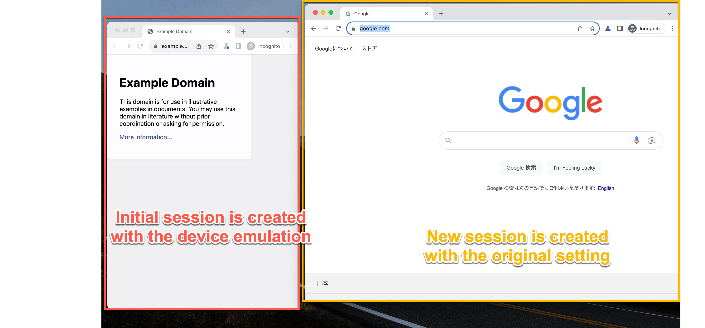

# Codeceptjs Playwright Device Emulation Bug Reproduction

## Bug detail

If I open a new session during the session, it does not respect the device emulation setting.



## How to reproduce

```
$ npm install
$ npx codeceptjs run

CodeceptJS v3.5.11 #StandWithUkraine
Using test root "/Users/takuyasuemura/ghq/github.com/tsuemura/codeceptjs-playwright-device-bug-reproduction"

Repro --
sessionScreen is {"width":1280,"height":720}
  ✖ Reproduce issue in 2433ms

-- FAILURES:

  1) Repro
       Reproduce issue:

      AssertionError [ERR_ASSERTION]: The expression evaluated to a falsy value:

  assert(sessionScreen.width === 375)

      + expected - actual

      -false
      +true


  Artifacts:
  - screenshot: /Users/takuyasuemura/ghq/github.com/tsuemura/codeceptjs-playwright-device-bug-reproduction/output/Reproduce_issue.failed.png


  FAIL  | 0 passed, 1 failed   // 3s
Run with --verbose flag to see complete NodeJS stacktrace
```

In this example, the `sessionScreen` has the screen size of the new browser session. It should match to iPhone 6 screen size - 375x667.
